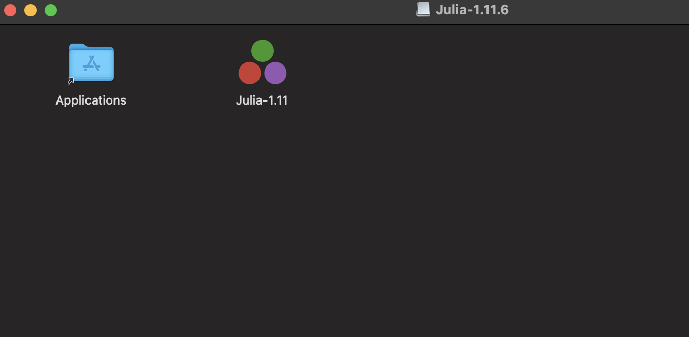
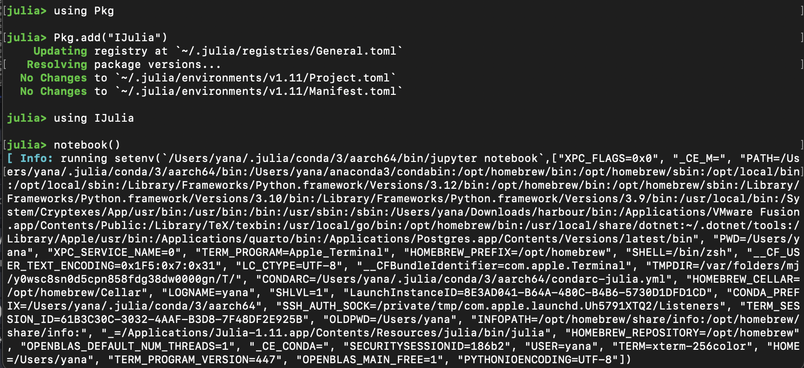
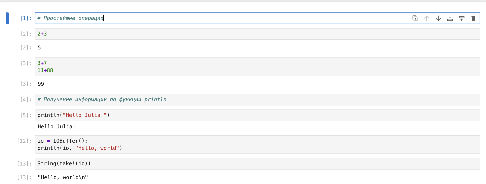
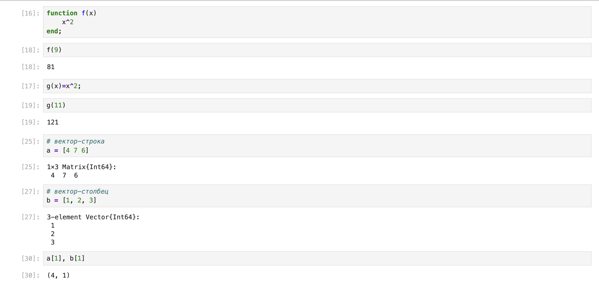

---
## Front matter
title: "Лабораторная работа 1"
subtitle: "Julia. Установка и настройка. Основные принципы."
author: "Ланцова Яна Игоревна"

## Generic otions
lang: ru-RU
toc-title: "Содержание"

## Bibliography
bibliography: bib/cite.bib
csl: pandoc/csl/gost-r-7-0-5-2008-numeric.csl

## Pdf output format
toc: true # Table of contents
toc-depth: 2
lof: true # List of figures
lot: true # List of tables
fontsize: 12pt
linestretch: 1.5
papersize: a4
documentclass: scrreprt
## I18n polyglossia
polyglossia-lang:
  name: russian
  options:
    - spelling=modern
    - babelshorthands=true
polyglossia-otherlangs:
  name: english
## I18n babel
babel-lang: russian
babel-otherlangs: english
## Fonts
mainfont: IBM Plex Serif
romanfont: IBM Plex Serif
sansfont: IBM Plex Sans
monofont: IBM Plex Mono
mathfont: STIX Two Math
mainfontoptions: Ligatures=Common,Ligatures=TeX,Scale=0.94
romanfontoptions: Ligatures=Common,Ligatures=TeX,Scale=0.94
sansfontoptions: Ligatures=Common,Ligatures=TeX,Scale=MatchLowercase,Scale=0.94
monofontoptions: Scale=MatchLowercase,Scale=0.94,FakeStretch=0.9
mathfontoptions:
## Biblatex
biblatex: true
biblio-style: "gost-numeric"
biblatexoptions:
  - parentracker=true
  - backend=biber
  - hyperref=auto
  - language=auto
  - autolang=other*
  - citestyle=gost-numeric
## Pandoc-crossref LaTeX customization
figureTitle: "Рис."
tableTitle: "Таблица"
listingTitle: "Листинг"
lofTitle: "Список иллюстраций"
lotTitle: "Список таблиц"
lolTitle: "Листинги"
## Misc options
indent: true
header-includes:
  - \usepackage{indentfirst}
  - \usepackage{float} # keep figures where there are in the text
  - \floatplacement{figure}{H} # keep figures where there are in the text
---

# Цель работы

Основная цель работы — подготовить рабочее пространство и инструментарий для работы с языком программирования Julia, на простейших примерах познакомиться с основами синтаксиса Julia.

# Задание

1. Установите под свою операционную систему Julia, Jupyter.
2. Используя Jupyter Lab, повторите примеры из раздела лабораторной работы.
3. Выполните задания для самостоятельной работы.

# Выполнение лабораторной работы

## Установка Julia и знакомство с синтаксисом

Установим Julia под мою операционную систему(рис. [-@fig:001]).

{#fig:001 width=70%}

Скачаем необходимые пакеты для работы с Julia(рис. [-@fig:002]):

{#fig:002 width=70%}

Теперь повторим простейшие примеры для знакомства с синтаксисом Julia (рис. [-@fig:003]-[-@fig:005]):

{#fig:003 width=70%}

{#fig:004 width=70%}

{#fig:005 width=70%}

После выполнения примеров, перейдем к выполнению заданий.

## Задание 1

Изучим документацию по основным функциям Julia для чтения / записи / вывода информации на экран: read(), readline(), readlines(), readdlm(), print(), println(), show(), write(). Приведем свои примеры их использования, поясняя особенности их применения.

Создадим текстовый файл с любым содержанием в папке, где мы работаем. Откроем его на чтение и прочитаем с помощью команды `read()`. Данная функция в качестве первого параметра принимает файл или поток (иначе стоковый буффер). Текст вывелся в одну строку с разделителями `\r\n`. Также прочитаем текст используя функцию `readline()` - выведется только первая строка. Чтобы прочитать все строки в файле используем команду `readlines()` (рис. [-@fig:006]).

{#fig:006 width=70%}

Далее посмотрим на работу readdlm(), print(), println() и show() (рис. [-@fig:007]). readdlm() считывает матрицу из указанного файла. print() может как вывести сообщение на экран, так и вывести его в поток. println() работает на аналогично, но каждое новое сообщение выводит на следующую строчку. show() выводит текст на экран как строку.

{#fig:007 width=70%}

Посмотрим на работу функции `write()`(рис. [-@fig:008]). Данная функция может записывать данные в стоковый буффер и файл.

{#fig:008 width=70%}

## Задание 2

Изучим документацию по функции parse(). Данная функция преобразует строки в другие типы данных. Приведем свои примеры её использования, поясняя особенности её применения (рис. [-@fig:009]).

{#fig:009 width=70%}

## Задание 3

Изучим синтаксис Julia для базовых математических операций с разным типом переменных: сложение, вычитание, умножение, деление, возведение в степень, извлечение корня, сравнение, логические операции. Приведем примеры с пояснениями по особенностям их применения(рис. [-@fig:010] -  [-@fig:011]):

{#fig:010 width=70%}

{#fig:011 width=70%}

## Задание 4

Приведем несколько примеров с пояснениями с операциями над матрицами и векторами: сложение, вычитание, скалярное произведение, транспонирование, умножение на скаляр (рис. [-@fig:012]-[-@fig:013]).

{#fig:012 width=70%}

{#fig:013 width=70%}

# Выводы

В результате выполнения данной лабораторной работы я подготовила рабочее пространство и инструментарий для работы с языком программирования Julia, на простейших примерах познакомилась с основами синтаксиса Julia.
