---
## Front matter
lang: ru-RU
title: Лабораторная работа 7
subtitle: Введение в работу с данными
author:
  - Ланцова Я. И.
institute:
  - Российский университет дружбы народов, Москва, Россия

## i18n babel
babel-lang: russian
babel-otherlangs: english

## Formatting pdf
toc: false
toc-title: Содержание
slide_level: 2
aspectratio: 169
section-titles: true
theme: metropolis
header-includes:
 - \metroset{progressbar=frametitle,sectionpage=progressbar,numbering=fraction}
 - '\makeatletter'
 - '\beamer@ignorenonframefalse'
 - '\makeatother'
 
---

# Информация

## Докладчик

:::::::::::::: {.columns align=center}
::: {.column width="70%"}

  * Ланцова Яна Игоревна
  * студентка
  * Российский университет дружбы народов

:::
::::::::::::::

## Цель работы

Основной целью работы является освоение специализированных пакетов Julia для обработки данных.

## Задание

1. Используя JupyterLab, повторите примеры. При этом дополните графики обозначениями осей координат, легендой с названиями траекторий, названиями графиков и т.п.
2. Выполните задания для самостоятельной работы.

# Выполнение лабораторной работы

## Выполнение лабораторной работы

{#fig:001 width=50%}

## Выполнение лабораторной работы

{#fig:002 width=50%}

## Выполнение лабораторной работы

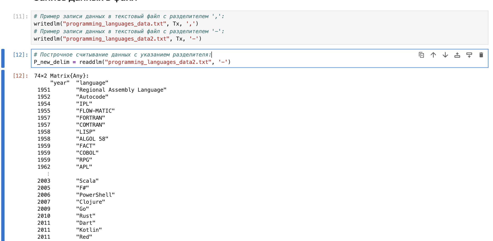{#fig:003 width=50%}

## Выполнение лабораторной работы

{#fig:004 width=50%}

## Выполнение лабораторной работы

{#fig:005 width=50%}

## Выполнение лабораторной работы

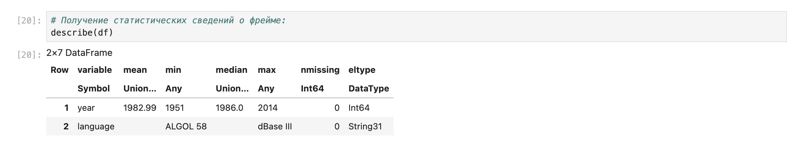{#fig:006 width=50%}

## Выполнение лабораторной работы

{#fig:007 width=50%}

## Выполнение лабораторной работы

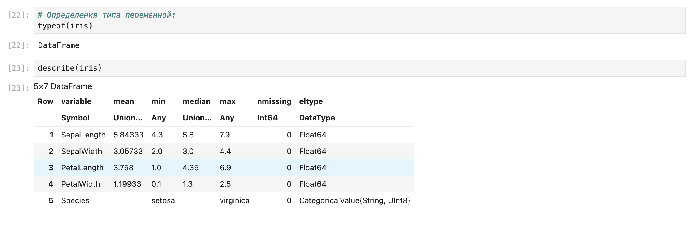{#fig:008 width=50%}

## Выполнение лабораторной работы

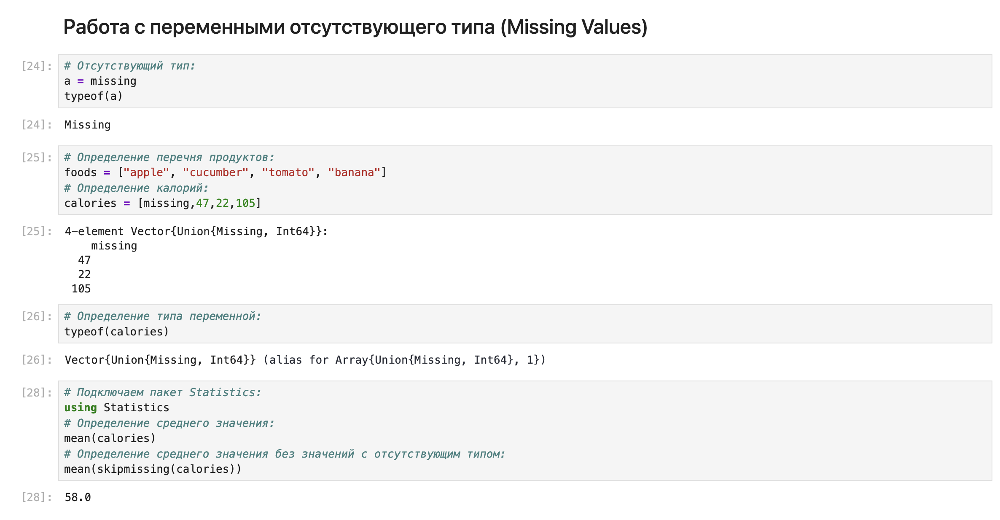{#fig:009 width=50%}

## Выполнение лабораторной работы

{#fig:010 width=50%}

## Выполнение лабораторной работы

{#fig:011 width=50%}

## Выполнение лабораторной работы

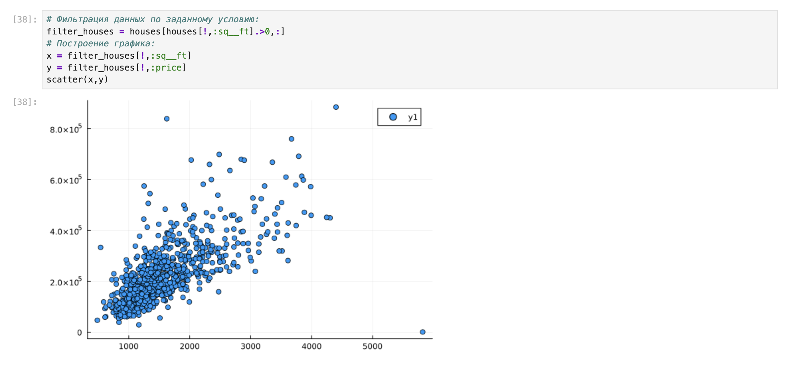{#fig:012 width=50%}

## Выполнение лабораторной работы

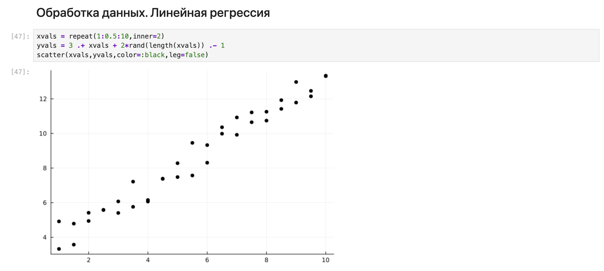{#fig:013 width=50%}

## Выполнение лабораторной работы

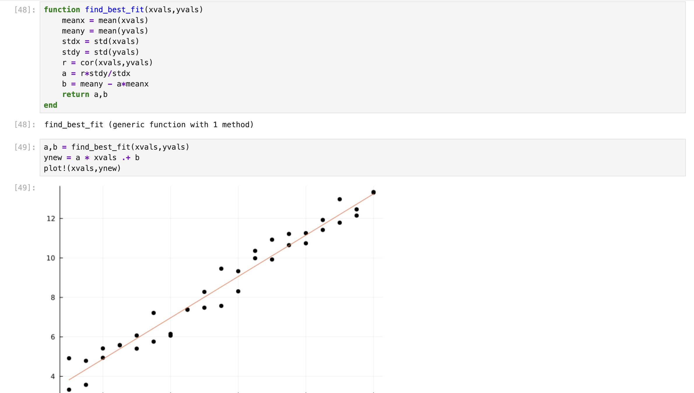{#fig:014 width=50%}

# Задание 1

## Выполнение лабораторной работы

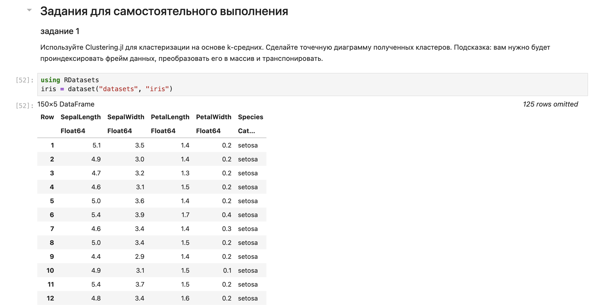{#fig:015 width=50%}

## Выполнение лабораторной работы

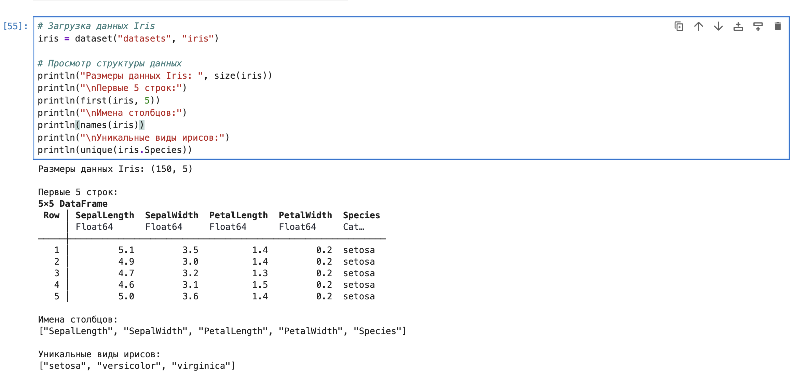{#fig:016 width=50%}

## Выполнение лабораторной работы

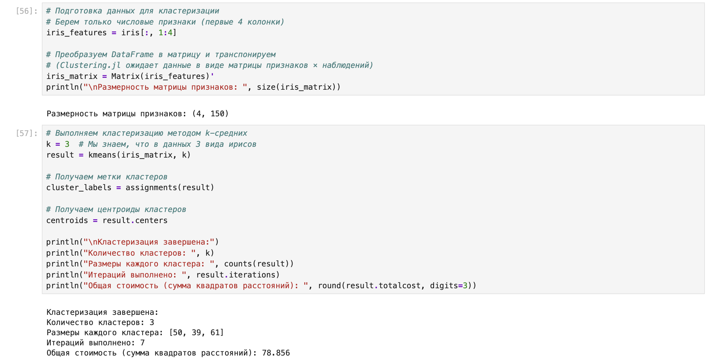{#fig:017 width=50%}

## Выполнение лабораторной работы

{#fig:018 width=50%}

## Выполнение лабораторной работы

{#fig:019 width=50%}

## Выполнение лабораторной работы

{#fig:020 width=50%}

## Выполнение лабораторной работы

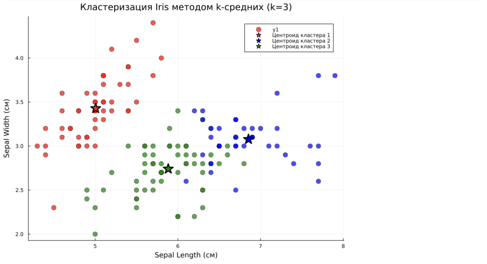{#fig:021 width=50%}

## Выполнение лабораторной работы

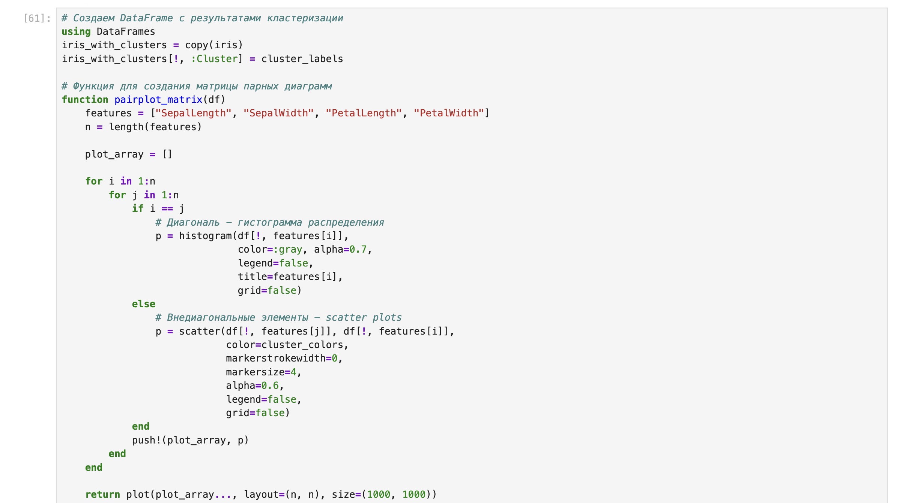{#fig:022 width=50%}

## Выполнение лабораторной работы

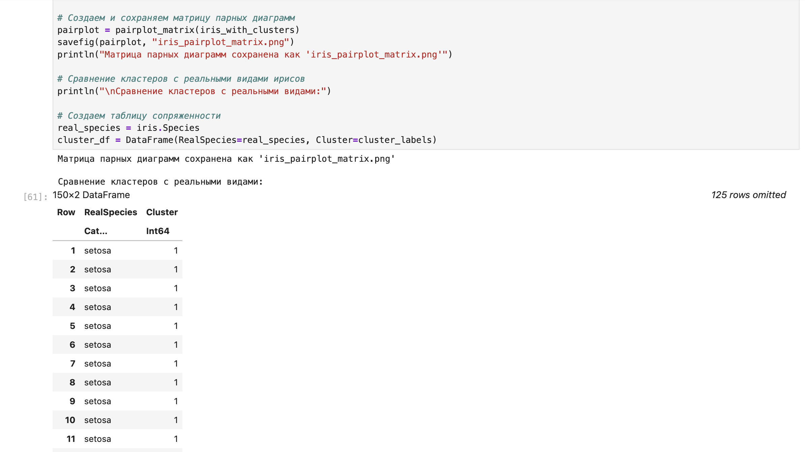{#fig:023 width=50%}

## Выполнение лабораторной работы

{#fig:024 width=50%}

# Задание 2

## Выполнение лабораторной работы

{#fig:025 width=50%}

## Выполнение лабораторной работы

{#fig:026 width=50%}

## Выполнение лабораторной работы

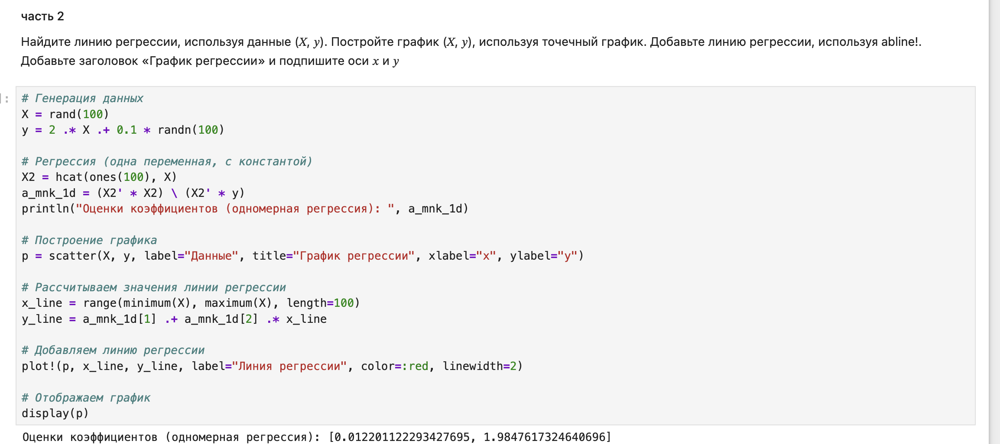{#fig:027 width=50%}

## Выполнение лабораторной работы

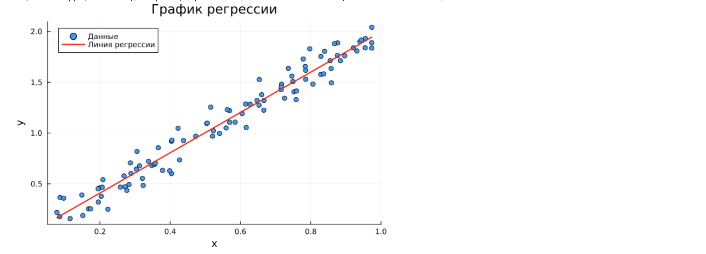{#fig:028 width=50%}

# Задание 3

## Выполнение лабораторной работы

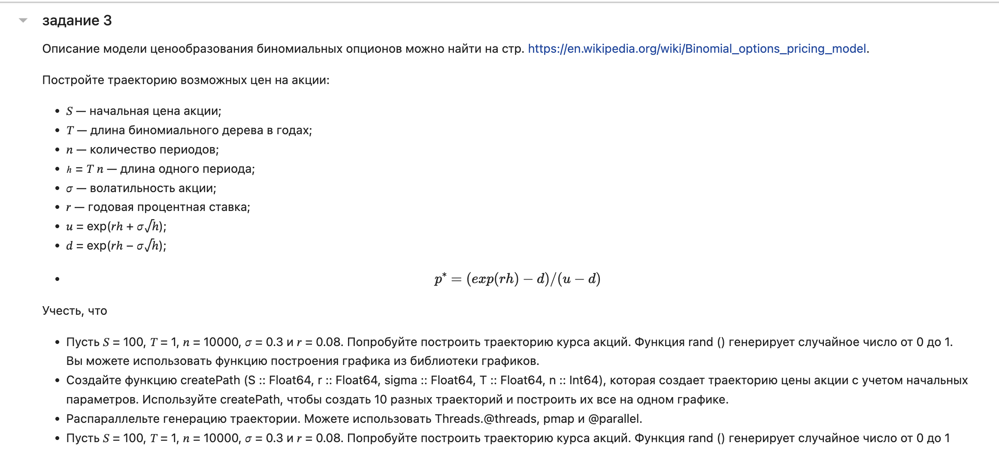{#fig:024 width=50%}

## Выполнение лабораторной работы

{#fig:030 width=50%}

## Выполнение лабораторной работы

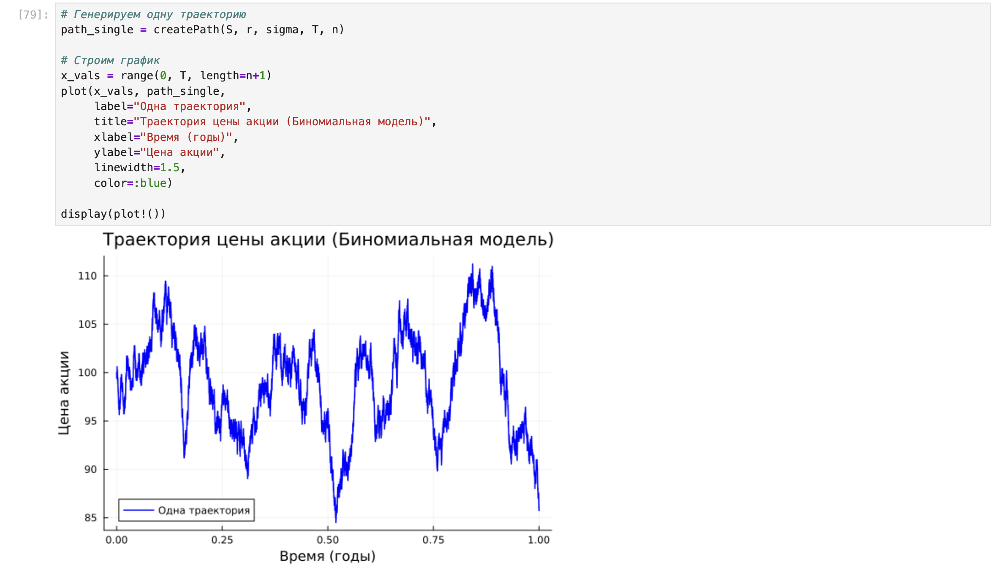{#fig:031 width=50%}

## Выполнение лабораторной работы

{#fig:032 width=50%}

## Выполнение лабораторной работы

{#fig:033 width=50%}

# Выводы

В результате выполнения данной лабораторной работы я освоила специализированные пакеты Julia для обработки данных.
