---
## Front matter
title: "Лабораторная работа 7"
subtitle: "Введение в работу с данными"
author: "Ланцова Яна Игоревна"

## Generic otions
lang: ru-RU
toc-title: "Содержание"

## Bibliography
bibliography: bib/cite.bib
csl: pandoc/csl/gost-r-7-0-5-2008-numeric.csl

## Pdf output format
toc: true # Table of contents
toc-depth: 2
lof: true # List of figures
lot: true # List of tables
fontsize: 12pt
linestretch: 1.5
papersize: a4
documentclass: scrreprt
## I18n polyglossia
polyglossia-lang:
  name: russian
  options:
    - spelling=modern
    - babelshorthands=true
polyglossia-otherlangs:
  name: english
## I18n babel
babel-lang: russian
babel-otherlangs: english
## Fonts
mainfont: IBM Plex Serif
romanfont: IBM Plex Serif
sansfont: IBM Plex Sans
monofont: IBM Plex Mono
mathfont: STIX Two Math
mainfontoptions: Ligatures=Common,Ligatures=TeX,Scale=0.94
romanfontoptions: Ligatures=Common,Ligatures=TeX,Scale=0.94
sansfontoptions: Ligatures=Common,Ligatures=TeX,Scale=MatchLowercase,Scale=0.94
monofontoptions: Scale=MatchLowercase,Scale=0.94,FakeStretch=0.9
mathfontoptions:
## Biblatex
biblatex: true
biblio-style: "gost-numeric"
biblatexoptions:
  - parentracker=true
  - backend=biber
  - hyperref=auto
  - language=auto
  - autolang=other*
  - citestyle=gost-numeric
## Pandoc-crossref LaTeX customization
figureTitle: "Рис."
tableTitle: "Таблица"
listingTitle: "Листинг"
lofTitle: "Список иллюстраций"
lotTitle: "Список таблиц"
lolTitle: "Листинги"
## Misc options
indent: true
header-includes:
  - \usepackage{indentfirst}
  - \usepackage{float} # keep figures where there are in the text
  - \floatplacement{figure}{H} # keep figures where there are in the text
---

# Цель работы

Основной целью работы является освоение специализированных пакетов Julia для обработки данных.

# Задание

1. Используя JupyterLab, повторите примеры. При этом дополните графики обозначениями осей координат, легендой с названиями траекторий, названиями графиков и т.п.
2. Выполните задания для самостоятельной работы.

# Выполнение лабораторной работы

Выполним примеры из лабораторной работы (рис. [-@fig:001] - [-@fig:010]).

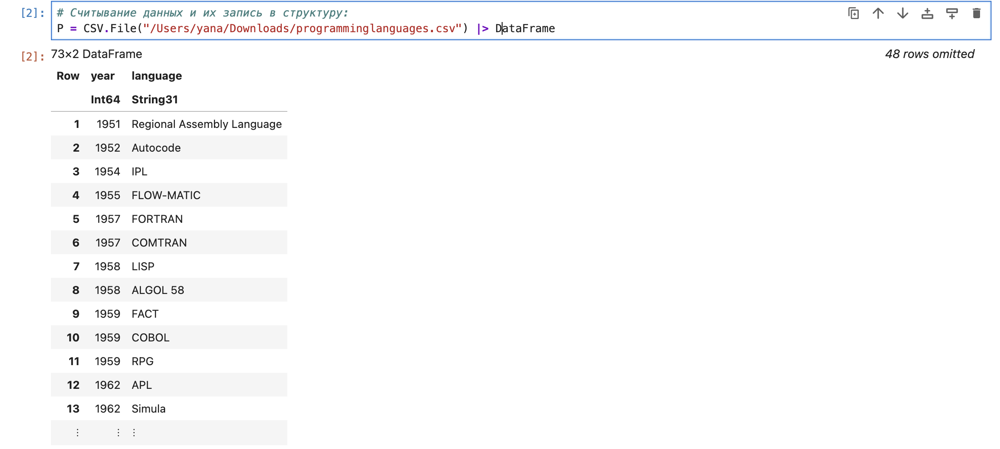{#fig:001 width=70%}

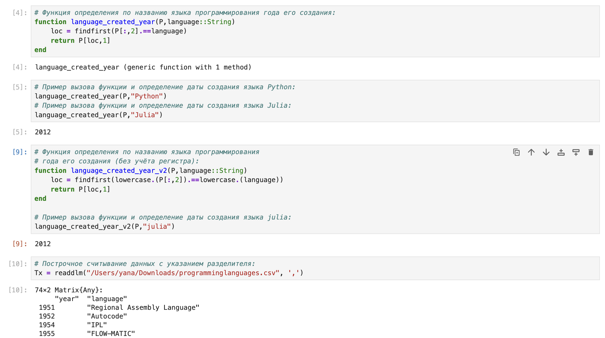{#fig:002 width=70%}

{#fig:003 width=70%}

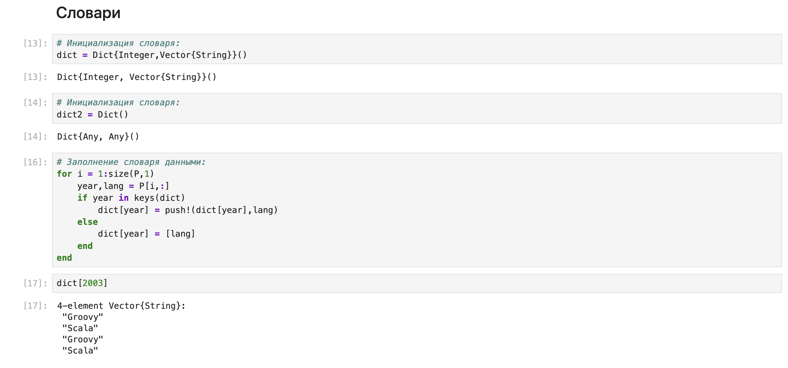{#fig:004 width=70%}

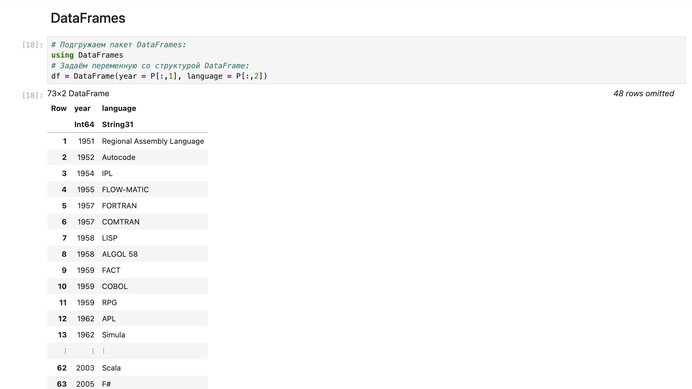{#fig:005 width=70%}

{#fig:006 width=70%}

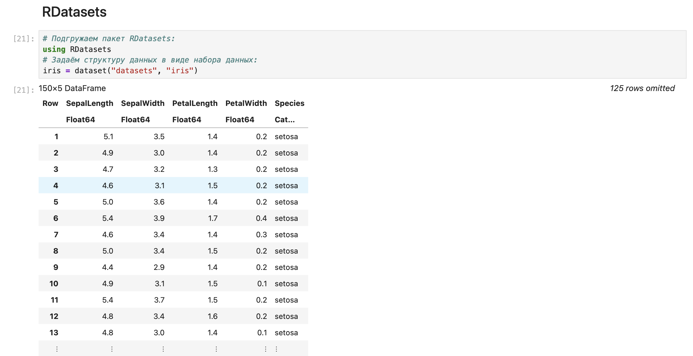{#fig:007 width=70%}

{#fig:008 width=70%}

{#fig:009 width=70%}

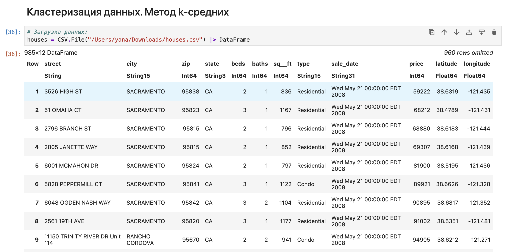{#fig:010 width=70%}

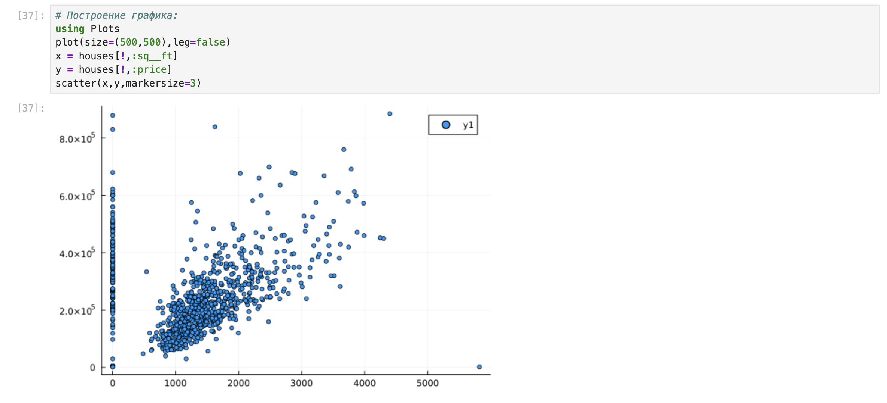{#fig:011 width=70%}

{#fig:012 width=70%}

{#fig:013 width=70%}

{#fig:014 width=70%}

Теперь перейдем к заданимям для самостоятельного выполнения

## Задание 1

Загрузим

```Julia
using RDatasets
iris = dataset("datasets", "iris")
```

Используем Clustering.jl для кластеризации на основе k-средних. Сделаем точечную диаграмму полученных кластеров. Для этого проиндексируем фрейм данных, преобразуем его в массив и транспонируем (рис. [-@fig:015] - [-@fig:024]).

{#fig:015 width=70%}

{#fig:016 width=70%}

{#fig:017 width=70%}

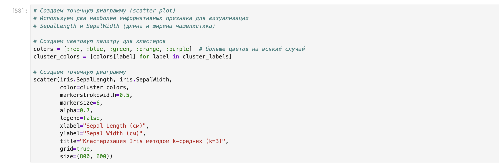{#fig:018 width=70%}

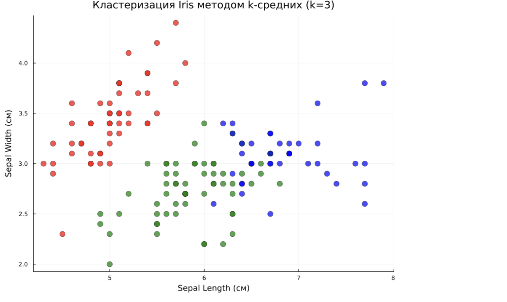{#fig:019 width=70%}

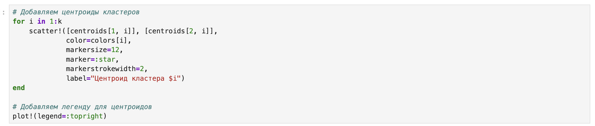{#fig:020 width=70%}

{#fig:021 width=70%}

{#fig:022 width=70%}

{#fig:023 width=70%}

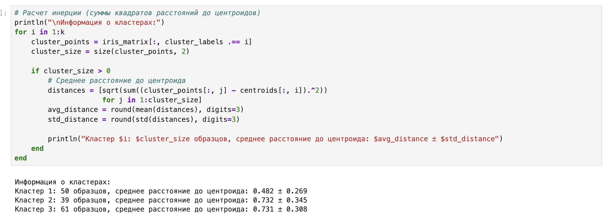{#fig:024 width=70%}

## Задание 2

Пусть регрессионная зависимость являетсял инейной. Матрица наблюдений факторов $X$ имеет размерность $N \times 3$ `randn (N, 3)`, массив результато в $N \times 1$, регрессионная зависимость является линейной. Найдем МНК-оценку для линейной модели (рис. [-@fig:025] - [-@fig:026]):

- Сравним свои результаты с результатами использования `llsq` из
`MultivariateStats.jl`.
- Сравним свои результаты с результатамии спользования регулярной регрессии наименьших квадратов из `GLM.jl`.

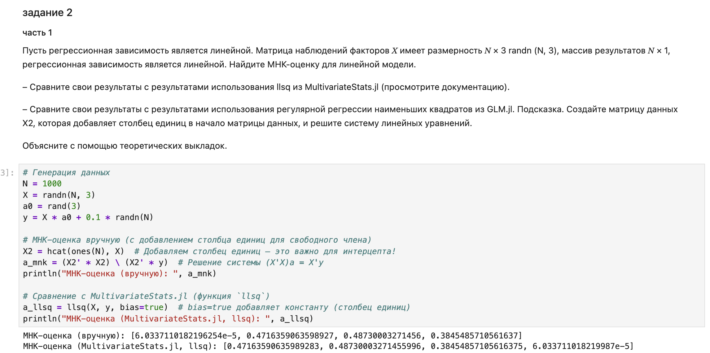{#fig:025 width=70%}

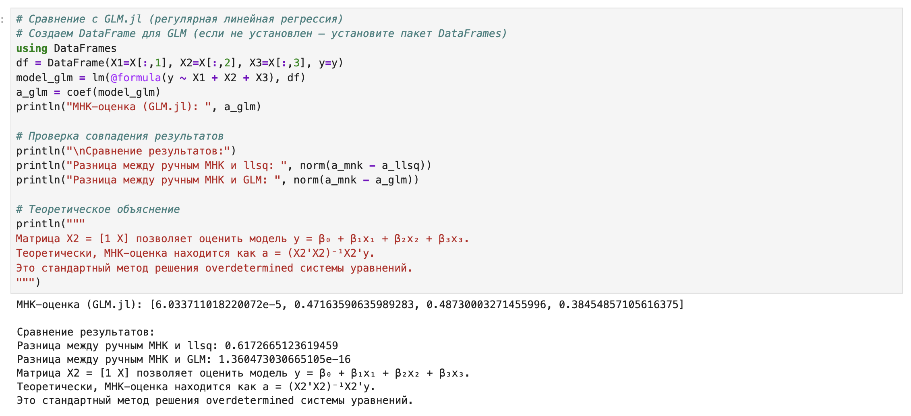{#fig:026 width=70%}

Найдем линию регрессии, используя данные $(X, y)$. Построем график $(X, y)$, используя точечный график. Добавим линию регрессии, используя abline!. Добавим заголовок «График регрессии» и подпишим оси $x$ и $y$ (рис. [-@fig:027] - [-@fig:028]):

{#fig:027 width=70%}

{#fig:028 width=70%}

## Задание 3

Построим траекторию возможных цен на акции:

- $S$ -- начальная цена акции;
- $T$ -- длина биномиального дерева в годах;
- $n$ -- количество периодов;
- $h = Tn$ -- длина одного периода;
- $\sigma$ -- волатильность акции;
- $r$ -- годовая процентная ставка;
- $u = \mathrm{exp}(rh + \sigma \sqrt{h})$;
- $d = \mathrm{exp}(rh - \sigma \sqrt{h})$;
- $p^* = \dfrac{\mathrm{exp}(rh) -d}{u - d}$;

Пусть $S = 100, \, T = 1, \, n = 10000, \, \sigma = 0.3$ и $r = 0.08$. Попробуем  построить траекторию курса акций (рис. [-@fig:029] - [-@fig:031]):

{#fig:029 width=70%}

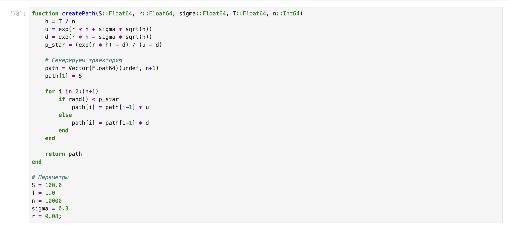{#fig:030 width=70%}

{#fig:031 width=70%}

Создадим функцию `createPath (S ::Float64, r ::Float64, sigma ::Float64, T ::Float64, n ::Int64)`, которая создает траекторию цены акции с учетом начальных параметров. Используем `createPath`, чтобы создать 10 разных траекторий и построим их все на одном графике (рис. [-@fig:032] - [-@fig:033]):

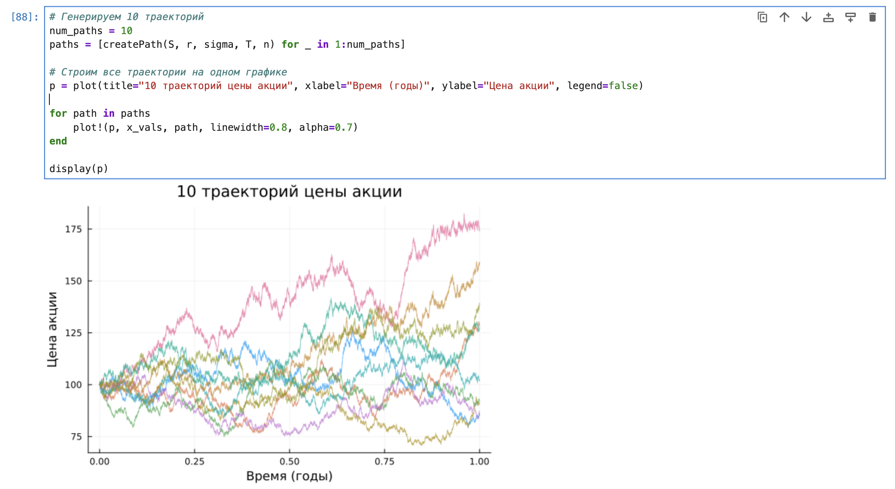{#fig:032 width=70%}

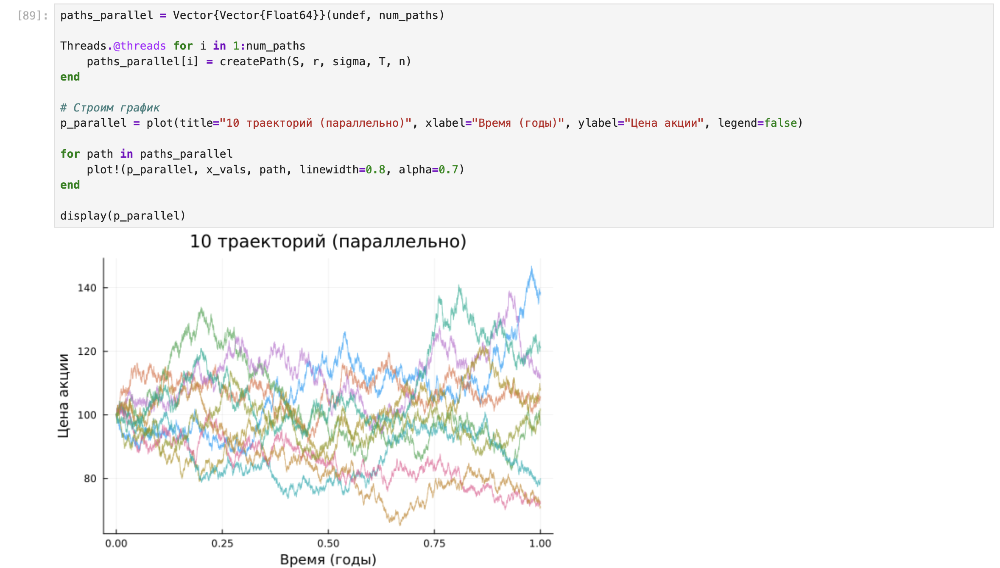{#fig:033 width=70%}

# Выводы

В результате выполнения данной лабораторной работы я освоила специализированные пакеты Julia для обработки данных.

